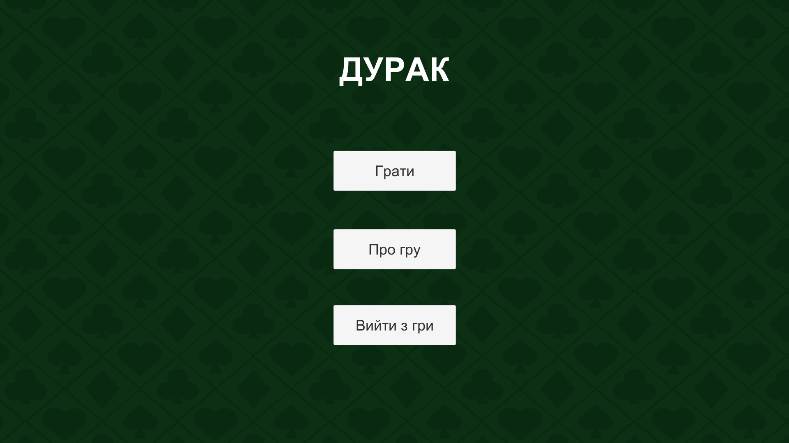
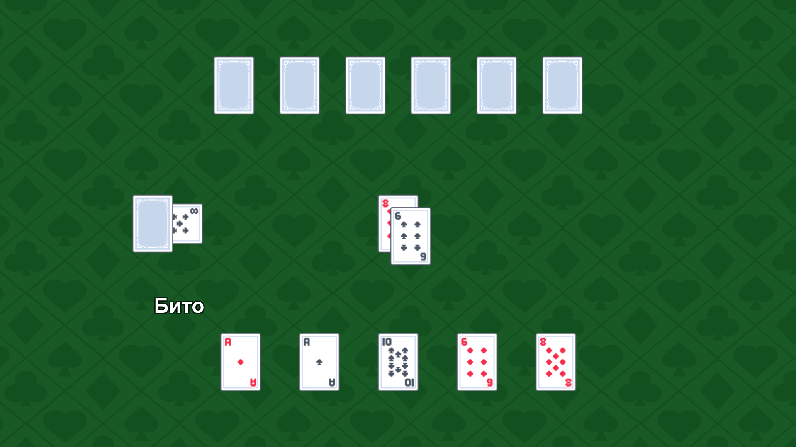
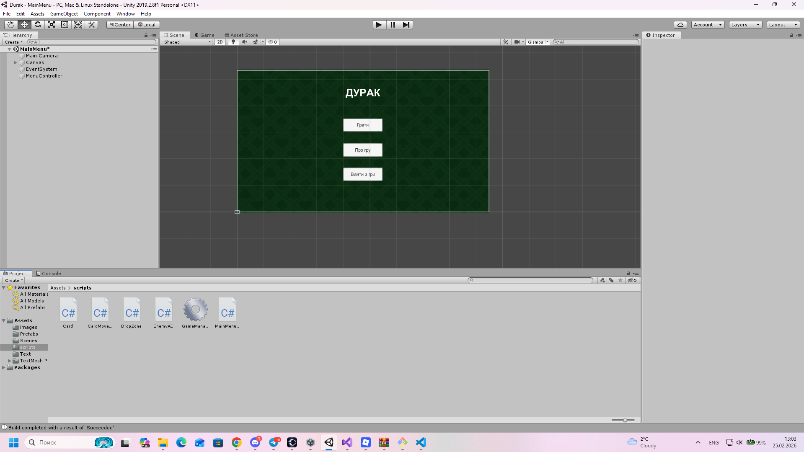

# 🃏 Durak Card Game

## 📄 About

This project is a digital adaptation of the popular card game **"Durak"** (Fool).

The main goal of this project is to implement standard card game logic and create a functional user interface using the **Unity Engine**.

## 🎮 Planned Features

* **Classic Rules:** Implementation of the standard "Transferable" (Podkidnoy) Durak rules.
* **Single Player Mode:** Play against a computer opponent (AI).
* **Card Deck:** Logic for a standard 36-card deck.

## 🛠️ Technologies Used

* **Engine:** Unity 2019.2.8f1
* **Language:** C#

## 🚀 How to Install & Play

1. **Download:** Go to the [Releases](https://github.com/TheMorsYT/durak/releases) page and download the latest `.zip` archive.
2. **Unpack:** Extract the contents of the archive into any folder on your PC.
3. **Run:** Open the folder and launch the game by double-clicking **`Durak.exe`**.

## 📸 Screenshots

## 📸 Screenshots

### Main Menu

*The main navigation hub where you can start the game or learn about the project.*

### Gameplay

*Core game arena with the deck, trump card, and player/bot hands.*

### Unity Editor View
(Images/editor1.png)
*Project structure and UI setup within the Unity Engine.*

## 👤 Author

**Tymofii Polyvianyi 25 група**

---
*Created for educational purposes.*
