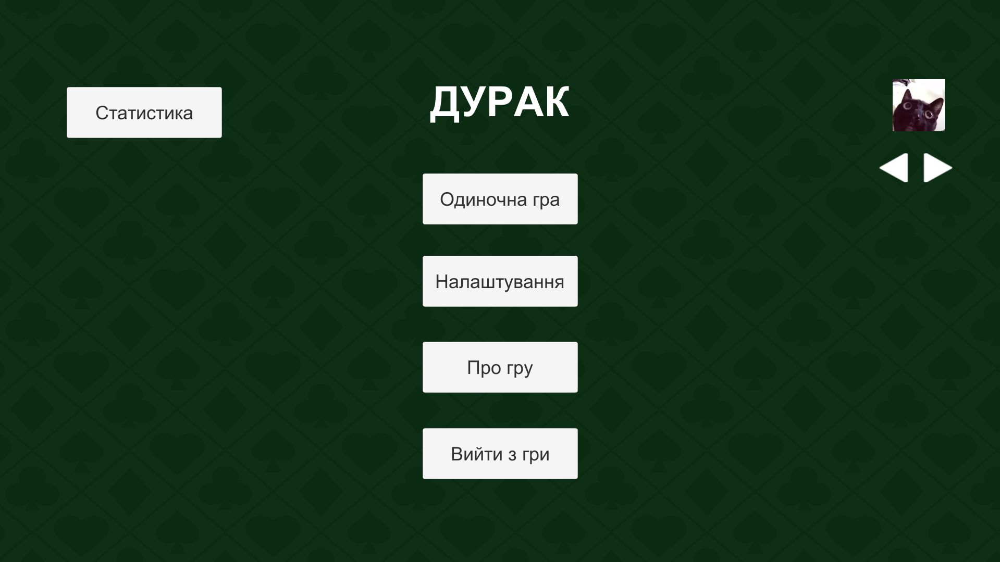
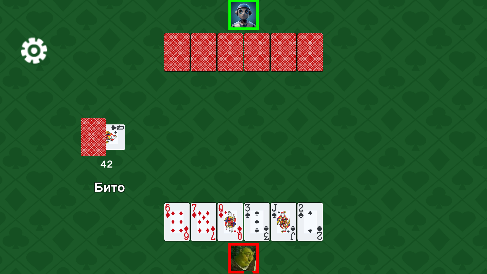
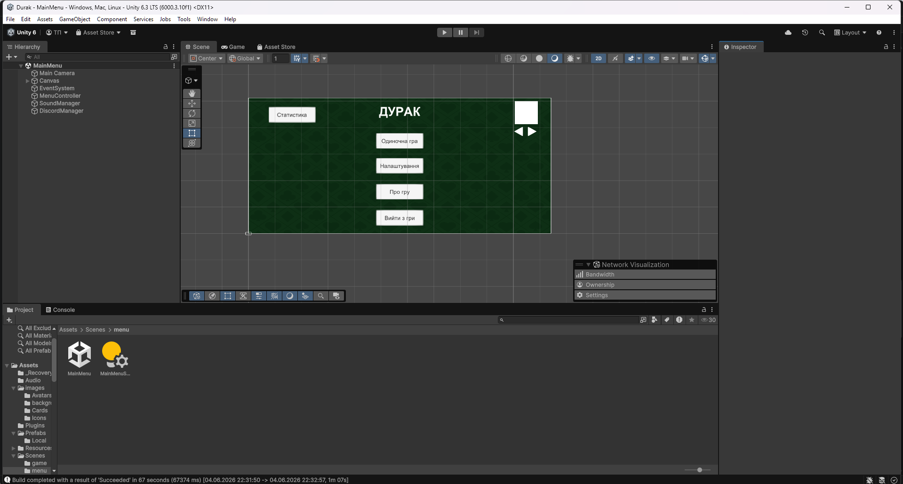
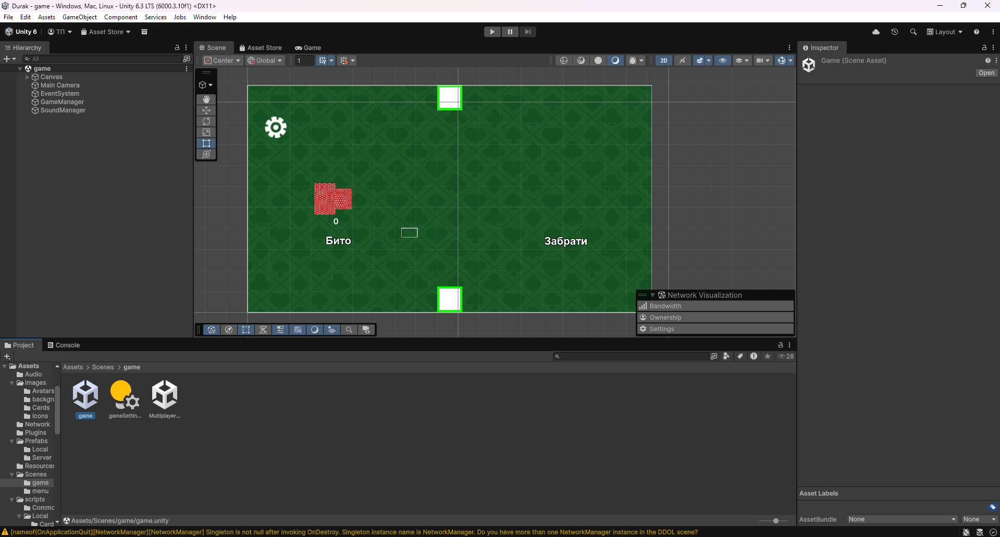

# 🃏 Durak Card Game

## 📄 About

This project is a digital adaptation of the popular card game **Durak**. The project implements standard card game logic, a functional user interface, player profile support, and a computer opponent using the **Unity Engine**.

## ✨ Current Features 

* **Cross-Platform Support:** Fully playable on **Windows (x64)**, **Android**, and **Linux**.
* **Linux Port:** Native Linux build support through the Unity executable file `Durak_v8.0.x86_64`.
* **Discord Integration:** Shows the current game status through Discord Rich Presence.
* **Player Profiles & Stats:** Supports nickname and avatar selection, plus match statistics tracking.
* **Dynamic Timers:** Visual turn timers control the pace of attacker and defender turns.
* **Smart Hand Sorting:** Supports manual sorting, sorting by rank, and sorting by suit.
* **Game Modes:** Implements both throw-in and transferable Durak rules.
* **Deck Options:** Supports 36-card and 24-card decks.
* **AI Opponent:** Includes a computer opponent that can attack, defend, transfer cards, and make follow-up decisions.
* **Settings & Localization:** Supports English and Ukrainian interface text.
* **Responsive UI:** Uses layouts and enlarged controls suitable for desktop and mobile screens.

## 🛠️ Technologies Used

* **Engine:** Unity 6 (6000.3.10f1)
* **Language:** C#
* **Integrations:** Discord Game SDK

## 🚀 How to Install & Play

### Windows

1. Download the Windows archive from the release package.
2. Extract the archive into any folder.
3. Launch the game through `Durak.exe`.

### Android

1. Download the `.apk` file from the release package.
2. Copy it to the device if needed.
3. Open the file on Android and allow installation from unknown sources if the system asks for it.

### Linux

1. Download the Linux archive from the release package.
2. Extract the archive into any folder.
3. Open a terminal in the extracted folder.
4. Give the executable permission:

   ```bash
   chmod +x Durak_v8.0.x86_64
   ```

5. Run the game:

   ```bash
   ./Durak_v8.0.x86_64
   ```

Keep `Durak_v8.0.x86_64`, `Durak_v8.0_Data`, `UnityPlayer.so`, and the included `.so` libraries in the same folder.

## 📸 Screenshots

### Main Menu



### Gameplay



### Unity Editor View




## 👤 Author

**Tymofii Polyvianyi (Group 25)**

---

Created for educational purposes.

